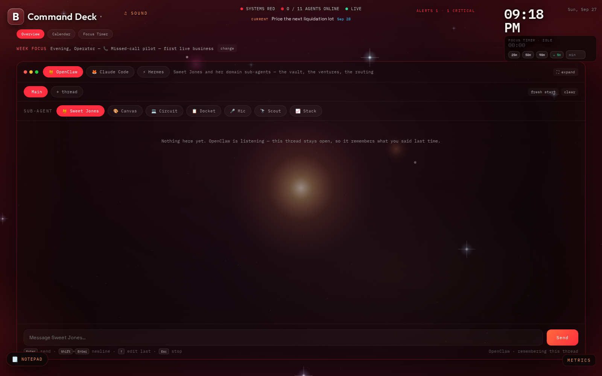
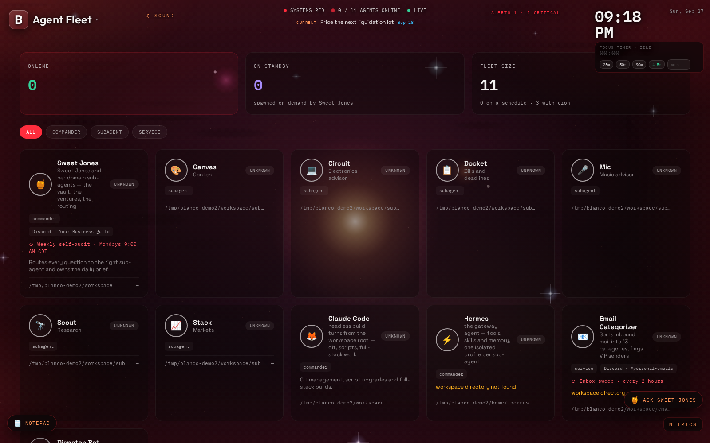
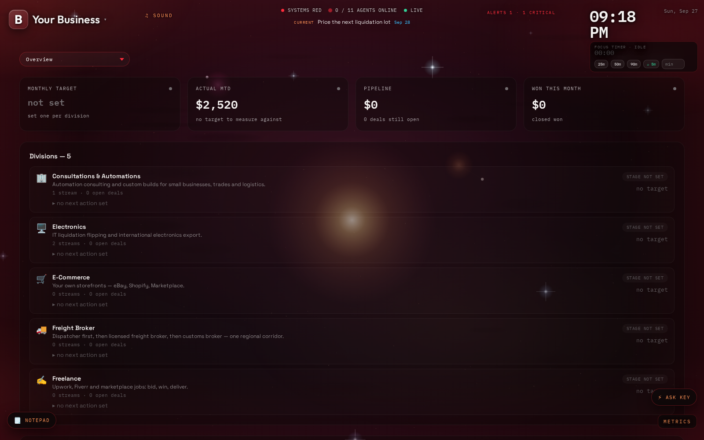

# Blanco OS

### Your whole life. One command deck.

Your tasks, your money, your businesses and your AI agents used to live in a dozen places.
Now they live in one. **Blanco OS** is a personal agentic operating system: one local API, one
glass command deck, and a whole fleet of AI agents that work for you.



---

## Talk to your agents. All of them.

Three AI commanders sit behind one console: **OpenClaw**, **Claude Code** and **Hermes**. Pick one,
pick a sub-agent, and type. Replies stream in live. Every thread remembers where you left off.
Add a new agent by dropping one file in a folder, and it shows up in the deck. No config. No restart.



## Run every business from one screen.

Divisions, ventures, a deal pipeline and a revenue ledger that rolls up on its own.
Record one sale and every total updates. Name it after your company. It's yours.



## Everything else, built in.

- **Command Deck.** Your whole day in one call: focus, tasks, alerts, the agent fleet and money.
- **Live, always.** A server-sent event stream keeps every screen current. No refresh button.
- **Tasks & calendar** that write straight back to your Obsidian vault.
- **Money & finance.** Ventures, cash flow, a debt snowball/avalanche planner, and a credit-repair tracker with FCRA 30-day clocks.
- **Cert track, journal & mood, knowledge search** across your notes.
- **Focus timer, notepad, and now-playing media control** from the deck.
- **Systems view.** Services, cron jobs and disks, watched for you.
- **Seven themes.** Red, Black, Ice, Toxic, Vapor, Gold and Deep.
- **Installable.** It's a PWA. Put it on your taskbar or your phone.

## Honest by design.

Blanco OS never invents a number. If a value can't be verified on disk, the deck says
**"not set"**, not a plausible guess. Agents are discovered, never hardcoded. The vault stays
the source of truth, and the OS writes through to it.

## Under the hood.

| | |
|---|---|
| **Backend** | Python 3.12 · FastAPI · Pydantic · SQLite with 23 sequential migrations |
| **Frontend** | One dependency-free HTML file. No build step. No `node_modules`. |
| **Realtime** | Server-sent events (`/api/stream`) |
| **Agents** | OpenClaw, headless Claude Code, and Hermes, streaming through one console |
| **Quality** | 269 tests. Every test runs against a throwaway vault and database. |
| **Ops** | systemd service, nightly backups with 14-day rotation, Discord alerts |

The full engineering notes, covering every module and every design decision, are in [docs/ARCHITECTURE.md](docs/ARCHITECTURE.md).

## Try it in two minutes.

```bash
git clone https://github.com/aaron27white-source/blanco-os.git
cd blanco-os
python3 -m venv .venv && .venv/bin/pip install -e ".[dev]"

# Run it on the bundled demo data. Everything in demo/ is fictional.
BLANCO_OS_VAULT_PATH=demo/vault \
BLANCO_OS_WORKSPACE_PATH=demo/workspace \
BLANCO_OS_PROBES_ENABLED=false \
.venv/bin/uvicorn app.main:app --port 8800
```

Open **http://localhost:8800**. To point it at your own life, copy `.env.example` to `.env`
and set your vault and workspace paths.

```bash
.venv/bin/python -m pytest -q   # run the suite
```

---

Built by **Aaron White** · AI Agent Engineer · Houston, TX ·
[GitHub](https://github.com/aaron27white-source) · [LinkedIn](https://www.linkedin.com/in/aaron-white-b4b197331)

*All data in screenshots and in `demo/` is fictional.*
